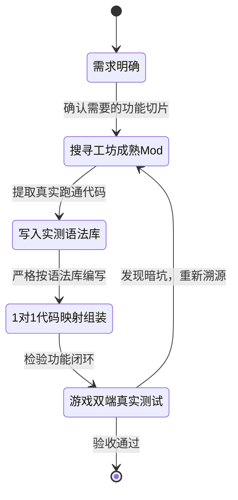

# 📌 《万象全书》研发任务看板与核心思想总则 (KANBAN.md)

> **最高宪章**：**严禁闭门造车，工坊即是真理；建立实测语法库，严禁任何无出处的代码臆想。**

---

## 🏛️ 核心思想与开发公约 (Core Principles)

### 1. 宏观原则：100% 溯源缝合 (Zero Blind Coding)
* **知识库不可靠律**：AI 的底层通用知识库充满过时 API 与伪记忆，严禁直接信赖。
* **工坊即真理**：我们遇到的任何功能与 Bug，创意工坊中早已被成千上万玩家跑通。遇到问题**第一动作永远是检索工坊成熟 Mod 源码并提取真实代码切片**。
* **极致做减法**：只做最纯粹的需求，严禁脑补任何未经验证的复杂技术术语与冗余功能。

### 2. 微观原则：实测语法库守门制 (Syntax Registry Gatekeeper)
* **单向真实源**：建立并在本地维护 [`.agent/SYNTAX_LIBRARY.md`](file:///d:/Study/Vue-/.agent/SYNTAX_LIBRARY.md)，只收录从成熟 Mod 中扒出并实测跑通的代码切片。
* **1 对 1 映射拦截**：Mod 中的每一行关键代码，必须在《语法库》中有对应的真实出处（注明 Mod ID、文件与行号）。**凡是在语法库中找不到出处的写法，一律视为非法臆想代码，禁止写入！**

### 3. 闭环验证：拒绝口头完成 (Empirical Feedback)
* 任何代码修改必须经过真实客户端 Log 捕获或游戏内真实操作闭环验证，严禁口头完成。

---

## 📊 研发任务看板 (Active Task Kanban Board)

| 任务 ID | 任务模块与核心目标 | 当前状态 | 对应工坊成熟源 (待提取) | 验收实测标准 |
| :--- | :--- | :---: | :--- | :--- |
| **TASK-01** | **【微观底座】建立实测语法与接口库** 创建 `.agent/SYNTAX_LIBRARY.md`，规范化记录真实有效的 Klei Lua 语法切片。 | 🟢 **已就绪** | 本地及工坊已验证 Mod 源码 | 语法库结构建立，包含真实调用模板。 |
| **TASK-02** | **【问题 2 解决】客机玩家右键翻书与专属 UI 唤起** 解决只有房主能翻书的问题，实现任意客机玩家右键道具 -> 服务端验证 -> 专属回传 RPC -> 该客机弹出本地 UI。 | 🟡 **进行中** | 创意工坊成熟多人道具书 Mod (如石化书等) | 客机玩家（非房主）背包内右键万象书 100% 弹出阅读并打开个人界面。 |
| **TASK-03** | **【问题 1 解决 + 界面升级】UI 双列任务布局与安全输入交互** 重构 UI 任务面板为 **「个人 Todo」** 与 **「团队 Todo」** 双列（或双 Tab）结构；废弃客户端非法 `SpawnPrefab("homesign")` 的残缺写法，实现原生的文本输入与增删改查。 | 🔴 **待处理** | 创意工坊成熟 UI 交互 / 记事本类 Mod | UI 清晰展示“个人任务”与“团队任务”双通道；点击添加任务安全弹出输入并实时展示。 |
| **TASK-04** | **【代码组装】1 对 1 映射核验与组装** 逐行比对 `modmain.lua`、`atlasbook_ui.lua` 与语法库，确认无任何未收录代码。 | ⚪ **未开始** | `.agent/SYNTAX_LIBRARY.md` | 每一行核心逻辑均能在语法库中溯源。 |
| **TASK-05** | **【真实验收】双端多人联机实操验收** 进房实测主机端与客机端的操作连贯性与数据同步。 | ⚪ **未开始** | 游戏客户端 + 服务端 Log | 主机与客机双向增删改查任务完全畅通。 |

---

## 🔄 标准执行流转状态机

